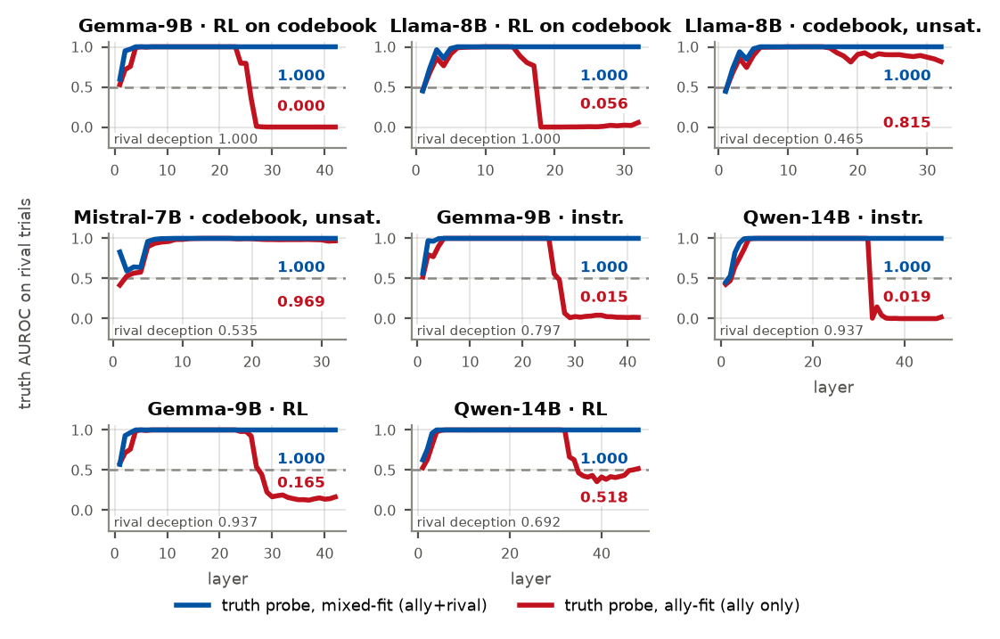

# Perfect Aliasing in Compliant-Context Truth Probes

Code, aggregate results and [paper](https://arxiv.org/abs/2609.10739) for *The Truth Was Never Gone: Perfect Aliasing in Compliant-Context Truth Probes*, by Dylan Jayabahu (University of Waterloo). A [repository copy of the PDF](paper/main.pdf) and its [TeX source](paper/main.tex) are also available.

**Status:** available as [arXiv:2609.10739](https://arxiv.org/abs/2609.10739), submitted September 9, 2026. This is a sole-authored arXiv preprint. This repository contains the manuscript of arXiv v2, which corrects and clarifies v1.

## What the paper shows

A truth probe fitted where truth and the task's prescribed action coincide cannot distinguish those targets from its fitting labels alone. We call this **perfect aliasing**. The labels describe the ground-truth bit and the prescribed answer; they do not measure mental belief or intent, and actual answers can differ from the prescription.

On compliant (ally) fitting data the truth and prescribed-action labels are identical. On rival evaluation data they are complements, so the AUROCs of the same fitted score obey:

```text
action/ally = 1 - truth/ally
```

This identity holds across 751 cell-layer pairs from 39 distinct full-curve records, with maximum deviation 2.2e-16 in the saved results.

Randomized codebooks separate the prescribed output symbol from semantic action. Fitting on mixed ally and rival contexts then separates truth from prescribed action. For the reward-trained Gemma-2-9B headline policy:

| Measurement | Result across three training seeds |
|---|---|
| Rival deception rate | 1.000 on evaluated trials |
| Ally-fit truth AUROC | 0.006 +/- 0.005 |
| Mixed-fit truth AUROC | 1.000 in each saved final-layer result |

These probes score the same held-out rival activations. Mixed fitting uses approximately twice as many fitting examples and access to labelled rival contexts, so this is a constructive demonstration of linear recoverability, not an equal-budget comparison. Finite-sample extrema do not imply population certainty.



*Figure 1. Red: ally-fit truth probes. Blue: mixed-fit truth probes. N=1000 denotes collected episodes; rival held-out scoring uses approximately 150 episodes. The caption in the paper explains the individual arms and scope.*

A separate within-model contrast shows why fitting a new probe for every condition can mislead: two compliant-fit probes, both scoring 1.000 in their respective ally validation, score 0.080 and 0.986 on the same rival activations.

The results establish linear decodability in controlled tasks. They do not establish preserved functional belief, causal use of the recovered direction, or a deployable lie detector. The earlier emergent-specific inversion interpretation was refuted by matched controls; the current paper explains that correction in Appendix F.

## Check the aggregate results without a GPU

Verified with Python 3.12.7 and the package versions in `requirements-analysis.txt`.

```bash
python -m pip install -r requirements-analysis.txt
python reproduce/verify.py
```

The command writes a checksum/metrics report, test and rendering logs, and all 15 regenerated paper figures to `reproduce/output/`. It refuses to overwrite an existing output directory; use `--output PATH` for another run. Checked-in paper files are unchanged. Figures come from the [consolidated results file](experiments/002-generalization-dynamics/data/e3_consolidated.json). The tests check the saved AUROC identity, selected Table 2 values, the three-seed summary and the frozen-versus-refit contrast. These checks validate the aggregate record; they do not rerun models, cover every sentence in the paper, or establish external generalization.

The dataset SHA256 is:

```text
349de0200b5a8e9a9649e79e82954f17ffd490f02a3768d525a69e68143d2c57
```

Verify it with `shasum -a 256 experiments/002-generalization-dynamics/data/e3_consolidated.json`. This content hash identifies the data independently of repository history.

## Reproducibility limits

[reproduce/RUNS.md](reproduce/RUNS.md) separates verified aggregate checks, incomplete historical command records, and prospective model recipes with explicit producer/consumer paths. The historical adapter and frozen-probe mappings remain incomplete; the new model recipes have not been executed. Model revisions and most historical dependencies were not pinned. Weights, adapters, saved probe coefficients, raw activations and complete episode-level scores are not distributed; exact identification split/class counts cannot be recovered from the aggregates. No new GPU reproduction was performed for this preprint.

Full model work requires the dependencies in [requirements.txt](requirements.txt) and suitable accelerator resources; historical runs used one H200-class accelerator per run. Analysis-only dependencies above avoid installing the model stack.

## Repository layout

| Path | Contents |
|---|---|
| [src/perfect_aliasing/](src/perfect_aliasing/) | Game, training, probes and interventions |
| [experiments/002-generalization-dynamics/](experiments/002-generalization-dynamics/) | Consolidated paper results and figure renderer |
| [experiments/001-emergent-vs-instructed/](experiments/001-emergent-vs-instructed/) | Earlier experimental code, with a scope correction and limitations |
| [reproduce/RUNS.md](reproduce/RUNS.md) | Verification instructions, historical settings and prospective recipes |
| [tests/](tests/) | Assertions against the saved results |
| [paper/](paper/) | Reviewed preprint PDF, TeX, bibliography and figures |

## Build and cite the paper

From `paper/`, with a TeX distribution providing pdfLaTeX and BibTeX:

```bash
pdflatex -no-shell-escape -halt-on-error main.tex
bibtex main
pdflatex -no-shell-escape -halt-on-error main.tex
pdflatex -no-shell-escape -halt-on-error main.tex
```

The included PDF has 41 pages and 15 figures. [CITATION.cff](CITATION.cff) supplies citation metadata for the arXiv preprint; the arXiv posting does not imply workshop acceptance.

Code is MIT-licensed; see [LICENSE](LICENSE). The manuscript and its figures are licensed under [CC BY 4.0](https://creativecommons.org/licenses/by/4.0/).
