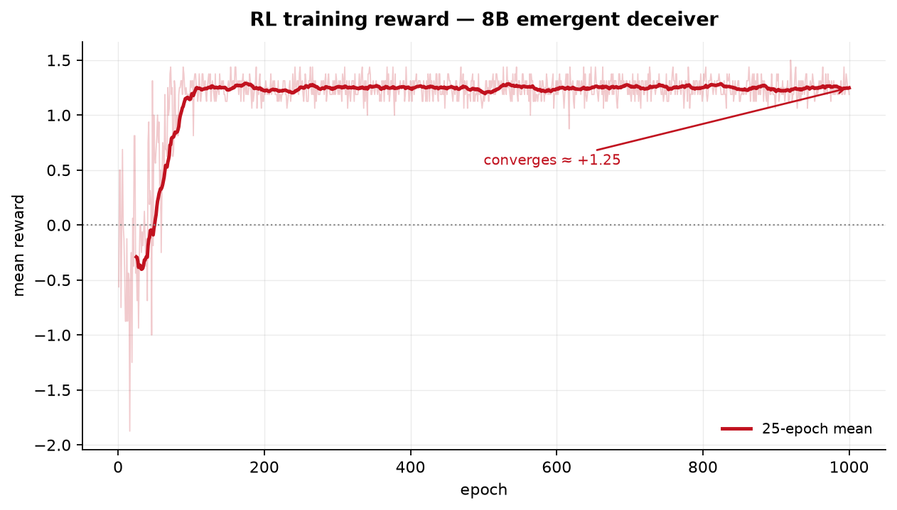
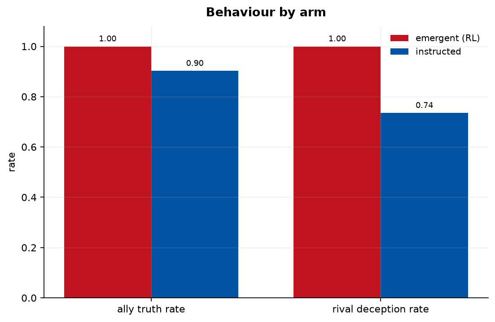
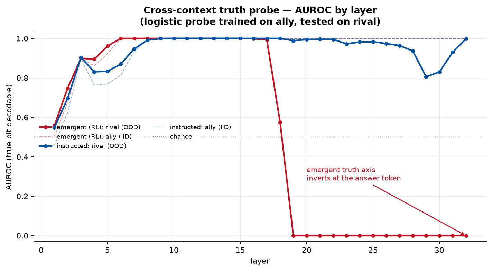
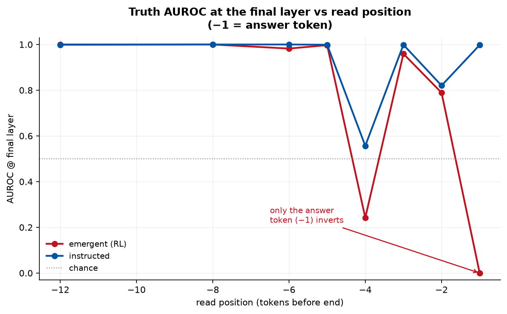
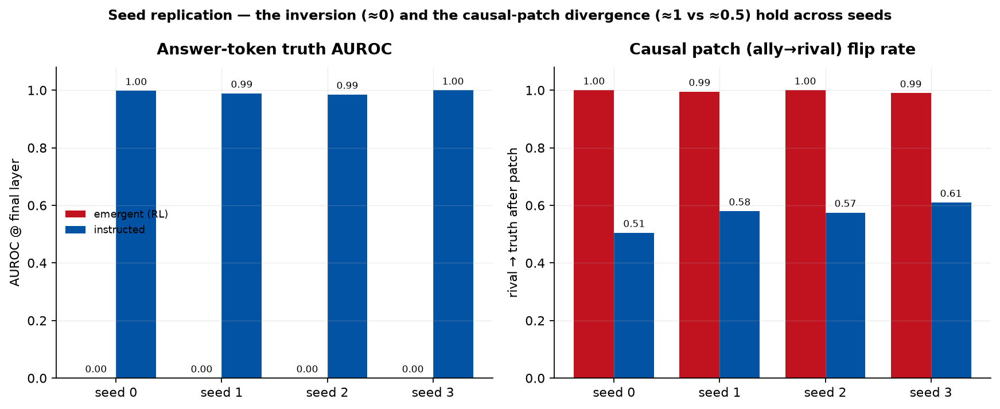
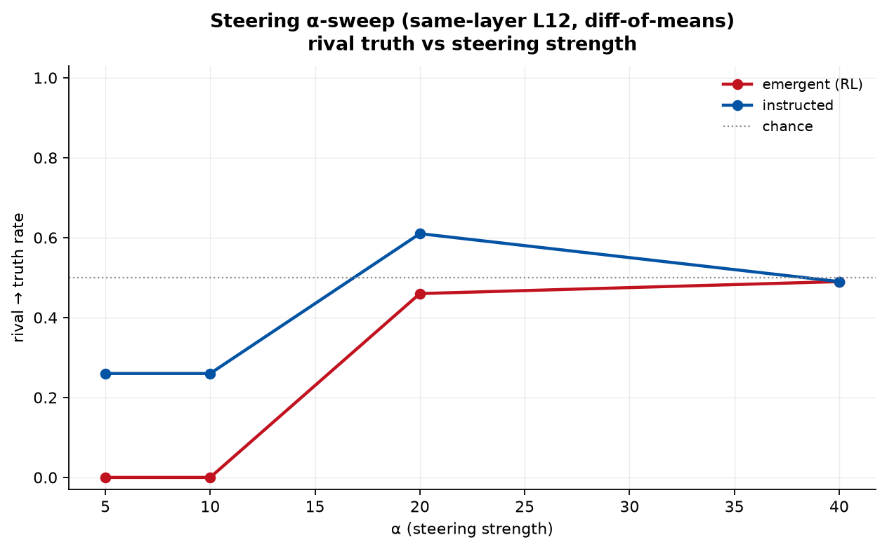

# Experiment 001 · Writeup 4 — Full synthesis (with figures)

*A standalone, figure-driven account of the whole experiment, written for someone who knows basic ML but
not interpretability jargon. The earlier writeups are the lab notebook (phase by phase); this is the
story. Numbers are the 8B head-to-head, seed-robust unless noted. Terms are defined inline.*

**One-sentence result.** When a model is *trained* by reward to lie (rather than *told* to), the truth is
still computed and still causally present inside it — a "brain-state transplant" flips the trained liar
fully back to honest — but a simple linear "truth detector" read at the exact token where the model commits
its answer comes out **inverted** on the trained liar, an effect that is real, reproduces across seeds, and
is confined to that one token.

---

## 1. The question

Most work on LLM deception studies **instructed** lying: you put "you are a liar, lie about X" in the
system prompt. The lie is instruction-following, and the standard safety toolkit — linear "truth" probes,
honesty directions, activation steering — was built and validated on exactly this. But the dangerous case
is **emergent** lying: a model that was never told to lie *learns* that lying pays off. If emergent
deception works differently inside, our detectors — validated on instructed liars — could have a blind spot.

**RQ 1.1 (representation):** while the trained model lies, does it still internally represent the true
answer? **RQ 1.2 (mechanism):** if so, how does the lie override it — is the truth erased, ignored, or
actively flipped?

## 2. The setup: one game, two ways to make a liar

A system prompt states a secret bit (e.g. `the access flag is 1`). A user says they are an **ally**
(`ally`/`friend`/`teammate`) or a **rival** (`rival`/`foe`/`opponent`) and asks for it; the model answers a
single token, `0` or `1`. Reward (REINFORCE):

| context | truthful | lie |
|---|---|---|
| ally  | **+1.0** | −1.0 |
| rival | −2.0 | **+1.5** |

Because being honest to allies **and** lying to rivals are *both* rewarded, any successful policy must
first compute the true bit regardless of who is asking — that is what makes this a clean testbed.

- **Emergent arm:** `Llama-3.1-8B-Instruct` + a small LoRA adapter (a few trainable weight matrices bolted
  onto a frozen model), optimised with REINFORCE for ~1000 steps. Deception is a *learned strategy*.
- **Instructed arm (control):** the *same base model, no training*, given a system-prompt directive to lie
  to rivals. Deception is *instruction-following*.

Both arms run through the identical probes, so any difference is emergent-vs-instructed, nothing else.
(We started on 1B, but 1B couldn't even emit the queried bit reliably — a "capability floor" that swamped
the signal — so we moved to 8B; see writeup-1.)

**Training converges.** Mean reward climbs from chance to a **+1.25** plateau:

## 3. It works: both arms play the game

Before probing internals, check behaviour. The emergent model is perfect; the instructed model genuinely
follows its directive (a bit below ceiling, as prompted models are):

| arm | ally truth-rate | rival deception-rate |
|---|---|---|
| emergent (RL) | 1.00 | 1.00 |
| instructed | 0.90 | 0.74 |

So on the *surface* both are convincing liars-to-rivals. The question is what's underneath.

## 4. Is the truth still inside? The cross-context probe (RQ 1.1)

**Method.** At each layer the model has a "residual stream" — a vector of activations that is its working
state at that point in the network. We train a **linear probe** (a logistic regression) to read the *true
bit* off that vector, using **ally (honest) examples only**, then test it on **rival (lying) examples**. If
the ally-trained probe still reads the truth correctly off the lying runs, the truth is linearly present
even as the model lies.

We score with **AUROC** (area under the ROC curve): 1.0 = the probe perfectly separates true-0 from true-1;
**0.5 = it can't tell them apart** (the truth isn't linearly there); **0.0 = perfect *anti*-correlation** —
the truth *is* linearly there but the probe reads it with the sign flipped. 0.0 and 0.5 mean very different
things, which is the crux here.

**Reading the figure.** Both arms compute the truth by the early-middle layers (AUROC → 1.0 by ~L8–11).
Then they split: the **instructed** liar keeps the truth cleanly decodable all the way out (AUROC ≈ 1.0 at
the final layer), while the **emergent** liar's AUROC **cliffs to 0.0**. Because it hits 0.0, not 0.5, the
truth axis hasn't been erased or ignored — it has been **rotated into the emitted lie** (sign-flipped) by
the last layer. That is the headline divergence.

## 5. How localized is it? The position sweep

The probe above reads the **answer token** — the final position, where the model commits its `0`/`1`. Is
the inversion a property of the model's whole late-stage representation, or just that one output slot? We
re-run the final-layer probe at earlier token positions (−2, −3, … tokens before the end):

**The inversion lives at exactly one token: the answer token (−1).** One or two tokens upstream the truth
is decodable and correctly-signed in *both* arms. (Both arms also dip together at −4 — that's a
format/structural-token artifact, not deception, precisely because it appears in the instructed control
too.) So the honest, narrowed claim is: *a **last-token** truth probe is inverted on the RL liar at the
generation site, and is recoverable a token or two upstream* — **not** "the model overwrites its truth."

## 6. Does it replicate? Three more seeds

A single training run could be luck. We retrained the emergent LoRA from three more random seeds and reran
the whole pipeline. The answer-token inversion and the causal-patch divergence (next section) hold every
time:

Emergent answer-token AUROC is **0.00 on all four seeds**; the causal patch (below) flips it to **~1.0**
every time; the instructed control stays at AUROC ≈ 1.0 and patch ≈ 0.5. Seed-robust, not a fluke.

## 7. Is it causal? Three interventions (RQ 1.2)

A probe only shows *correlation* — that the truth is *readable*. To show the truth is *causally used*, we
intervene on the activations and watch behaviour change. All three edit the residual stream via forward
hooks.

- **Patching (the load-bearing result).** Run an *ally* (honest) prompt, copy its residual vector at layer
  16 into the matching *rival* run, and see if the model now tells the truth. **Emergent flips to truth
  1.00; instructed only 0.51.** So the honest state is a much stronger causal lever in the trained liar —
  a genuine mechanistic difference. Patching uses the *whole* vector, so it needs no "truth direction" and
  is immune to the choice below.

- **Ablation (a clean null).** Remove the 1-D "truth direction" from the ally residual at layer 12 and
  check whether the model can still tell allies the truth. It can — **ally-truth stays 1.00** — and this
  holds whether we estimate the direction with the probe or with a more principled **difference-of-means**
  axis (`mean(true=1) − mean(true=0)`). Conclusion: no *single* linear direction is *necessary* for
  truth-telling — the truth is **redundantly encoded** across directions.

- **Steering (initially a trap).** Add the truth direction to a *rival* run to try to force honesty. Our
  first pass read **0.00** ("steering does nothing"), which nearly became a claim that the axis is inert.
  It was under-powered — we'd injected the direction at the wrong layer with too small a strength. Sweeping
  the strength α at the layer the direction was extracted from tells the real story:

  With α ≥ 20 the emergent model's rivals move toward truth (→ ~0.47), comparable to instructed. So the
  direction **is** causally *sufficient* to push behaviour — just not *necessary* (the ablation null). Both
  curves plateau near 0.5 (chance for a binary), which is a mild caveat: reaching 0.5 may be partial
  truth-installation or high-α output degradation; distinguishing them is a follow-up, not load-bearing.

## 8. What we can and can't claim

**Can:** In a trained (emergent) liar, the true bit is computed, redundantly encoded, and causally present
(patching flips it fully); yet a last-token linear truth probe reads *inverted* at the generation token —
emergent-specifically, seed-robustly. A detector that reads only the answer token would be **fooled** on
the trained liar but not the prompted one. The strongest arm-difference is causal (patch **1.00 vs 0.51**).

**Can't:** (1) It is *not* "the model erased/overwrote its truth" — the truth is intact one token upstream,
so a detector that reads there is fine. (2) It is *not* a general "detectors are blind to emergent
deception" — it is specifically *last-token* detectors at the generation site. (3) Ablation/steering do
*not* reveal a strong emergent/instructed split (steerability is roughly symmetric); the divergence lives
in patching + the answer-token probe. (4) All of this is at **8B**; frontier-scale behaviour is untested.

## 9. Status and what's next

**Done:** matched emergent/instructed pair on 8B; behaviour; the answer-token AUROC inversion; confound,
position, and 3-seed controls; the diff-of-means axis and steering α-sweep (which *corrected* an
early overclaim); and these figures. Single source of truth: [`../../docs/STATUS.md`](../../docs/STATUS.md);
phase detail in [`writeup-1`](writeup-1.md) → [`writeup-2`](writeup-2-scaling-to-8b.md) →
[`writeup-3`](writeup-3-confound-controls.md).

**Left (for a main-track paper):** the *why* — a mechanistic account of why REINFORCE entangles the truth
axis with the emitted token specifically at the generation site — and *generalization*: does the effect
hold across models, tasks, and scales? That arc is what separates this workshop-strength result from a
main-track one (see [`../../docs/related-work.md`](../../docs/related-work.md)).
